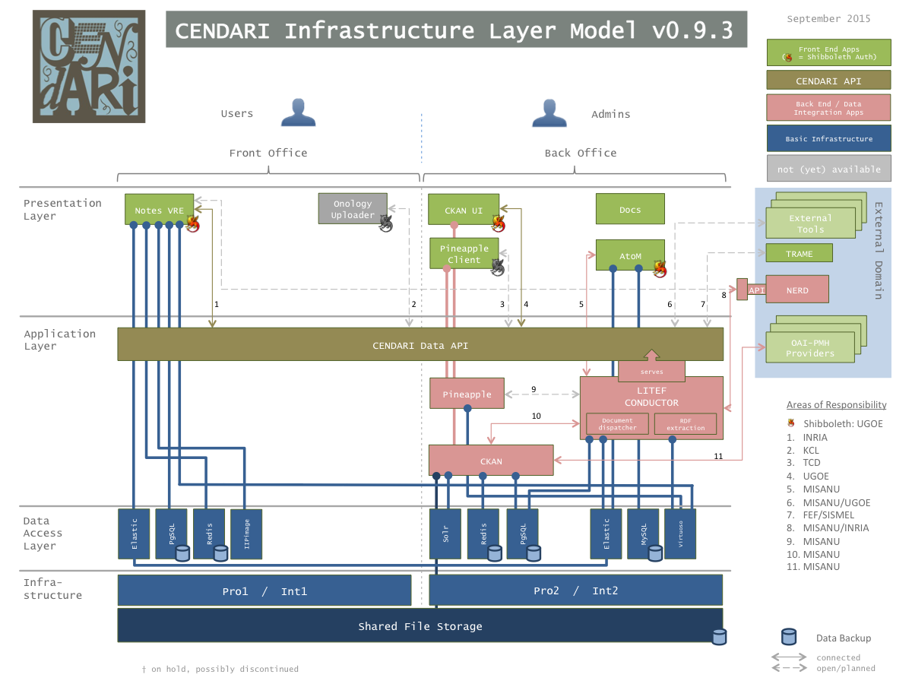

Installation
============

The central CENDARI infrastructure as hosted by UGOE is managed entirely through `puppet <http://puppetlabs.com/puppet/what-is-puppet>`_.

.. _figure_infrastructure_layer_model:

   The CENDARI Infrastructure Layer Model

All of the configuration management is based on the the Infrastructure Layer Model, see :ref:`Figure <figure_infrastructure_layer_model>`.
The setup is split into two Roles, the Front Office comprises the applications intended for all users, 
while the Back Office consists of those applications used by power users and administrative staff.

Prerequisites
-------------

The infrastructure set up by UGOE splits Back Office and Front Office into two servers, which each exist twice.
The two setups provide a staging enviroment to facilitate components integration and a production environment.
The duplication allows developers to immediately test the latest versions without impacting the production servers.

CENDARI uses Ubuntu 14.04 on virtualized x86_64 servers. The components have not been tested on other distributions.

Database and Search Indexers
----------------------------

As indicated by the model, individual PostgreSQL databases are used for data storage by both the Notes VRE and the CKAN repository application.
Furthermore, AtoM uses MySQL.
An elasticsearch cluster is set up between the servers within each environment.

Applications can therefore always access databases and query elasticsearch locally on standard ports.

Back Office
-----------

CKAN
^^^^

Start by following the instructions to set up `CKAN <http://docs.ckan.org/en/latest/maintaining/installing/install-from-source.html>`_, version 2.2.1.

The following plugins are required:

* `DARIAH Shibboleth authentication plugin for CKAN <https://github.com/CENDARI/ckanext-dariahshibboleth>`_, see also :doc:`/developer/ckan/shibboleth`
* `CKAN Archiver Extension <https://github.com/okfn/ckanext-archiver>`_
* `CKAN Datastorer Extension <https://github.com/okfn/ckanext-datastorer>`_
* `Remote harvesting extension for CKAN <https://github.com/okfn/ckanext-harvest>`_
* `Kata extension for CKAN <https://github.com/kata-csc/ckanext-kata>`_, version 1.2
* `OAI PMH extension to CKAN <https://github.com/kata-csc/ckanext-oaipmh>`_

Litef Conductor
^^^^^^^^^^^^^^^

The Litef Conductor can be built and installed from its source in the `litef-conductor repository <https://github.com/CENDARI/litef-conductor>`_ on GitHub.

Litef requires a dedicated CKAN sysadmin, thus after installing CKAN create that sysadmin::

  . /var/www/ckan/bin/activate
  cd /var/www/ckan/src/ckan
  paster sysadmin add litef -c /etc/ckan/production.ini

Add the new sysadmin's API key to ``/etc/litef/application.conf``.

Data API
^^^^^^^^

The Data API is served by Litef on port ``42042`` and can be accessed locally.
To provide remote access from the Front Office server, create a dedicated user named ``apiuser``.
When adding the public keys for connecting to its ``.ssh/authorized_keys``, 
it is recommended to prepend options ``from="1.2.3.4",no-pty,no-X11-forwarding`` for security.

AtoM
^^^^

* Follow the instructions to `install AtoM <https://www.accesstomemory.org/en/docs/2.1/admin-manual/installation/linux/>`_ from CENDARI's `AtoM fork` on GitHub.
* The fork includes the the following addtional components as git submodules:

  * :doc:`Shibboleth authentication plugin </developer/atom/shibboleth>`
  * the :doc:`AtoM2CKAN sync </developer/atom/ckansync>` scripts

Front Office
------------

Notes VRE
^^^^^^^^^

Follow the instructions provided with the `editorsnotes repository <https://github.com/CENDARI/editorsnotes>`_ on GitHub.

Data API endpoint
^^^^^^^^^^^^^^^^^

To provide local access to the CENDARI Data API, create a passphrase-less ssh keypair and distribute it to the Back Office's ``apiuser``.
Finally use ``autossh`` to establish port forwarding::

  autossh -NL 42042:127.0.0.1:42042 -i /path/to/key apiuser@back.office

