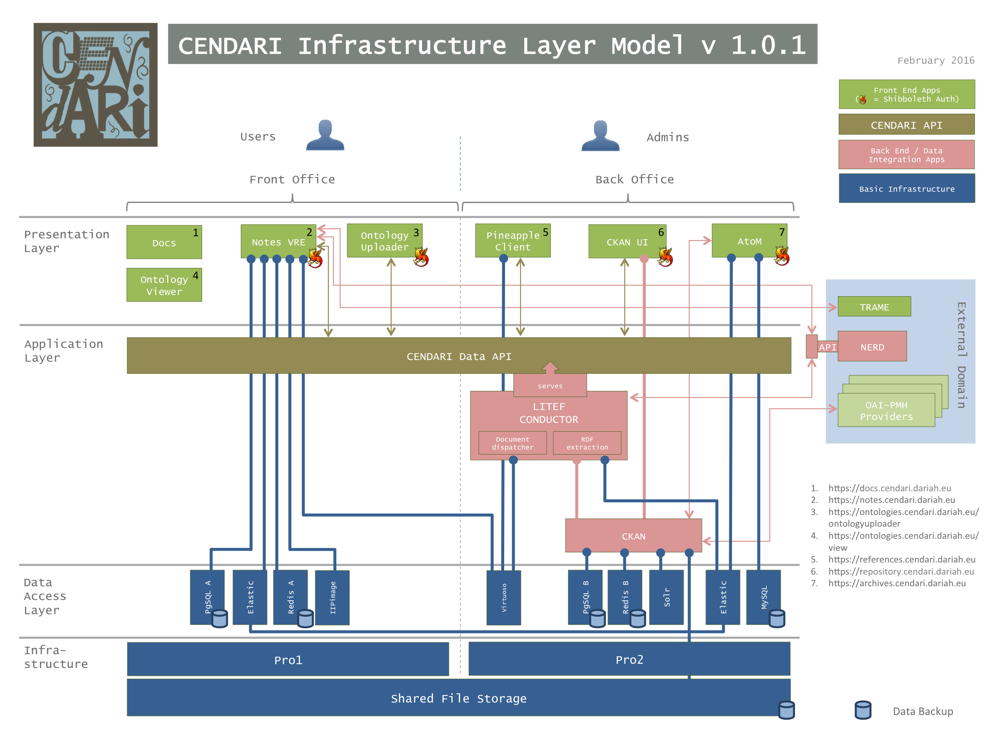

Installation
============

The central CENDARI infrastructure as hosted by UGOE is managed entirely through `puppet <http://puppetlabs.com/puppet/what-is-puppet>`_.

.. _figure_infrastructure_layer_model:

   The CENDARI Infrastructure Layer Model

All of the configuration management is based on the the Infrastructure Layer Model, see :ref:`Figure <figure_infrastructure_layer_model>`.
The setup is split into two Roles, the Front Office comprises the applications intended for all users, 
while the Back Office consists of those applications used by power users and administrative staff.

Prerequisites
-------------

The infrastructure set up by UGOE splits Back Office and Front Office into two servers, which each exist twice.
The two setups provide a staging enviroment to facilitate components integration and a production environment.
The duplication allows developers to immediately test the latest versions without impacting the production servers.

CENDARI uses Ubuntu 14.04 on virtualized x86_64 servers. The components have not been tested on other distributions.

The following packages are installed on all servers:

.. code-block:: puppet

    package { 
      'fabric':            ensure => installed;
      'g++':               ensure => installed;
      'libsasl2-dev':      ensure => installed;
      'nfs-common':        ensure => installed;
      'nodejs':            ensure => installed;
      'nodejs-legacy':     ensure => installed;
      'npm':               ensure => installed;
      'openjdk-7-jdk':     ensure => installed;
      'python-pip':        ensure => installed;
      'python-virtualenv': ensure => installed;
    }

In addition, some node packages are globally available

.. code-block:: bash    

    npm install -g less@1.3.3
    npm install -g node-sass@3.2.0

     
Database and Search Indexers
----------------------------

As indicated by the model, individual PostgreSQL databases are used for data storage by both the Notes VRE and the CKAN repository application.
Furthermore, AtoM uses MySQL.
An elasticsearch cluster is set up between the servers within each environment.

Applications can therefore always access databases and query elasticsearch locally on standard ports.

Portal
------

The CENDARI Portal is made available through `Liferay <https://www.liferay.com>`_. 

Back Office
-----------

.. toctree::
    :hidden:
    :maxdepth: 5

    install/ckan
    install/litef
    install/atom
    install/docs

The BackOffice consists of the following components, that need to be installed in order:

#. :doc:`CKAN <install/ckan>`
#. :doc:`Litef Conductor <install/litef>`
#. :doc:`AtoM <install/atom>`
#. :doc:`Documentation <install/docs>`

Front Office
------------

.. toctree::
    :hidden:
    :maxdepth: 5

    install/notes
    install/apiendpoint

To set up the FrontOffice, you need:

#. :doc:`install/notes`
#. :doc:`install/apiendpoint`

