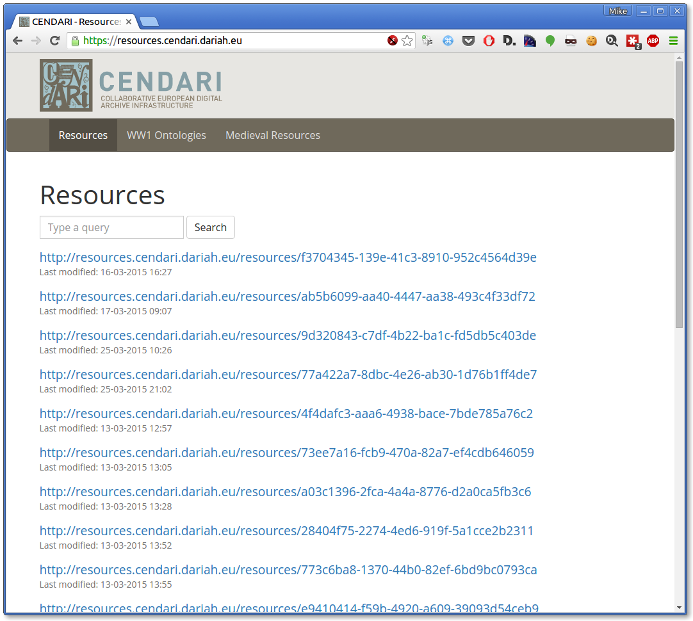
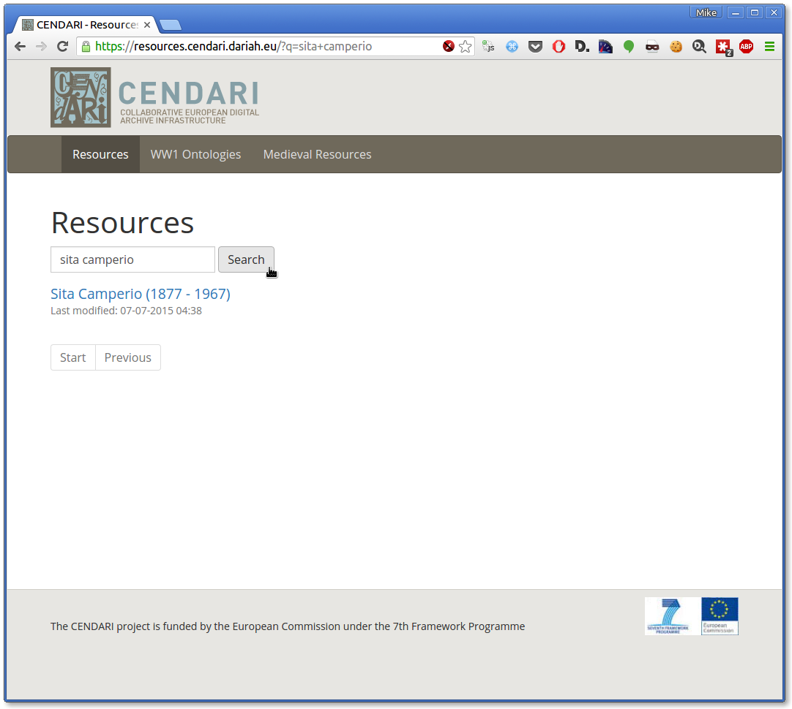
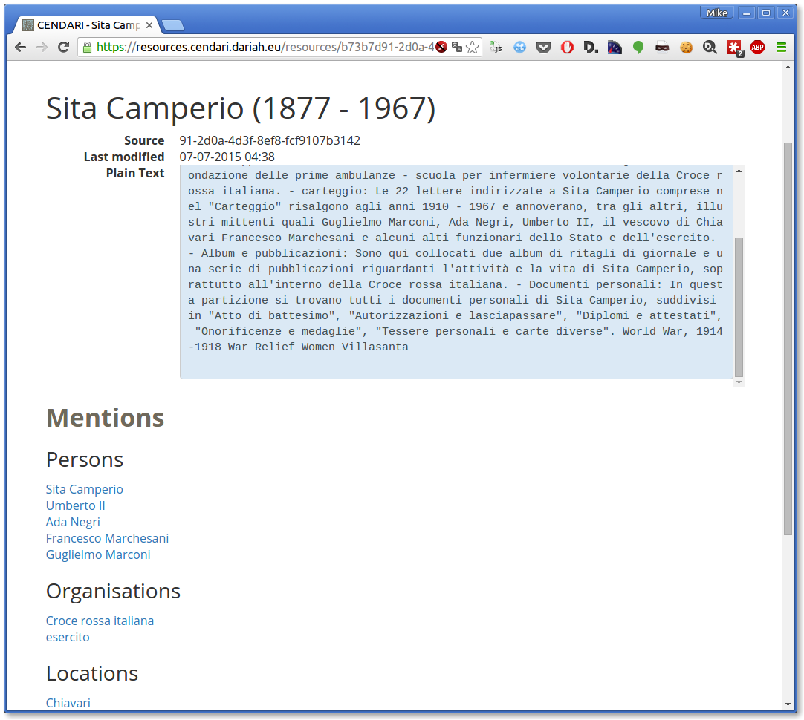
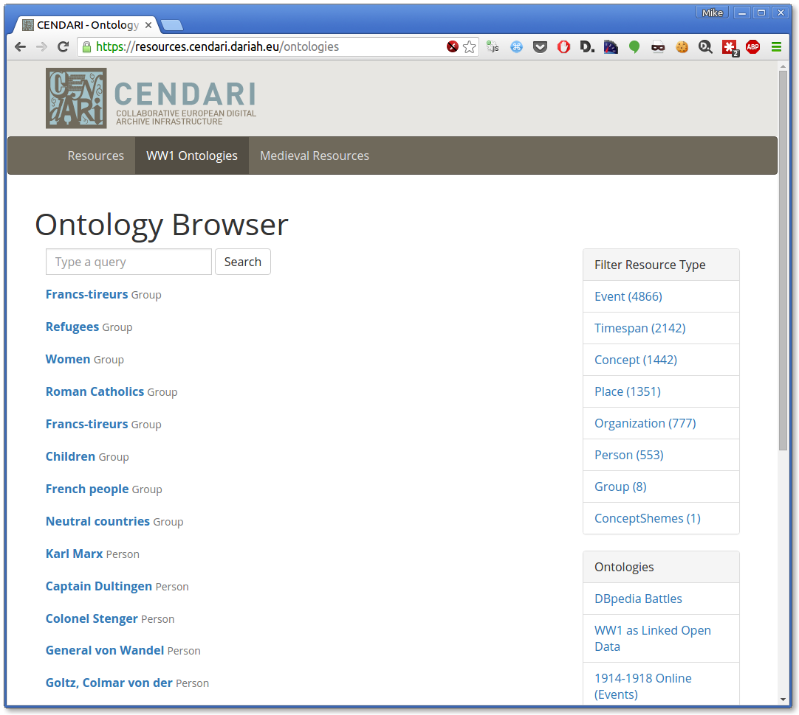
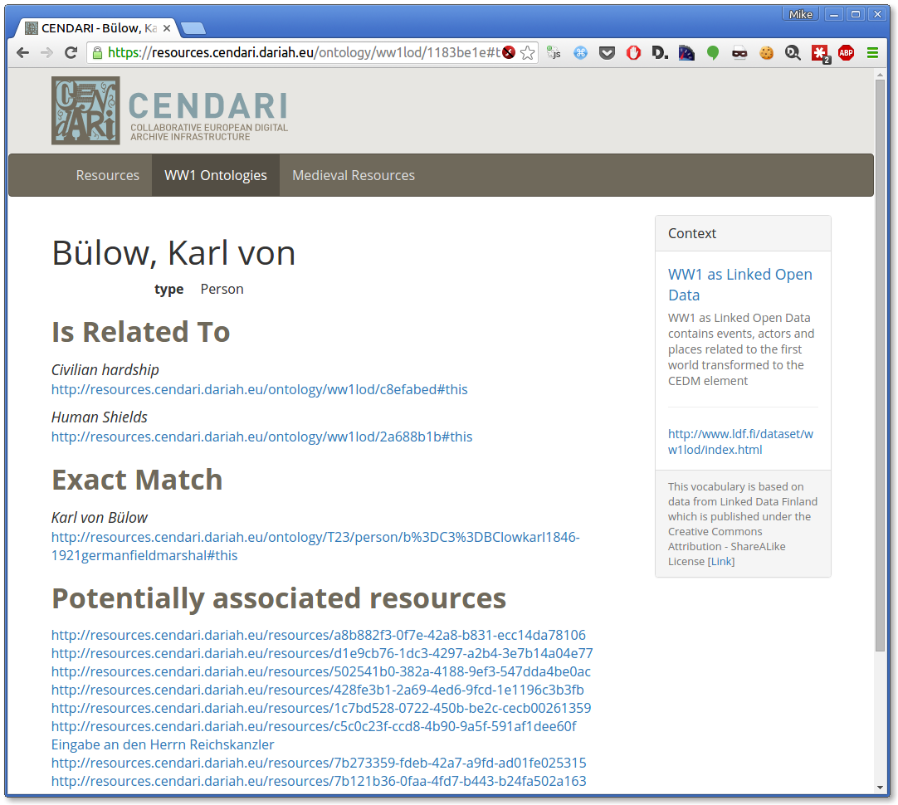
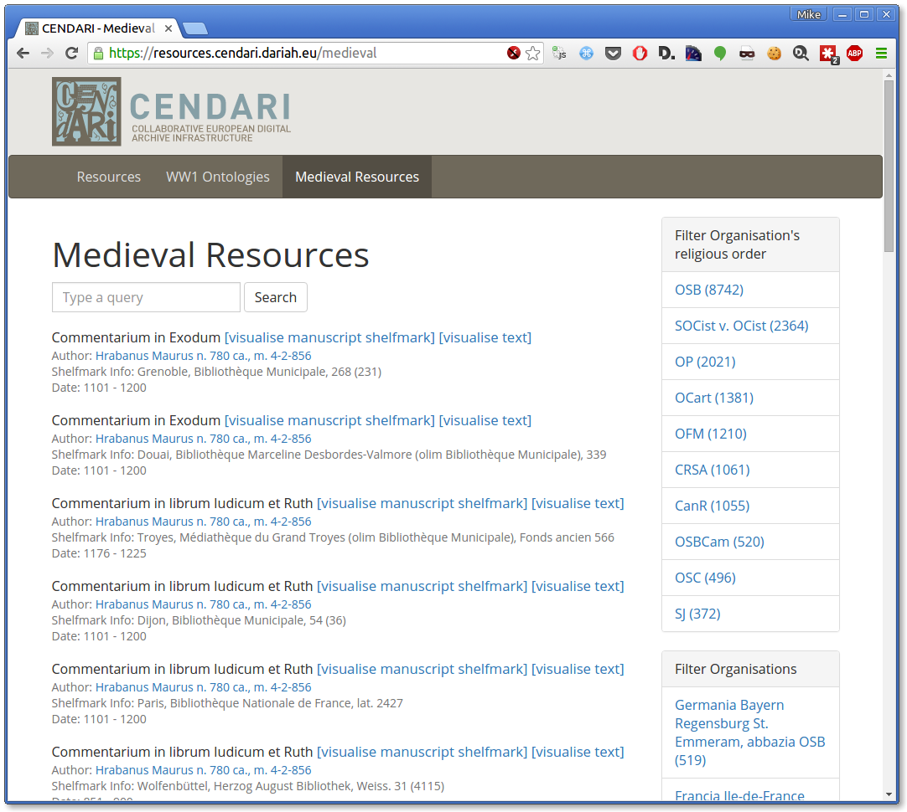
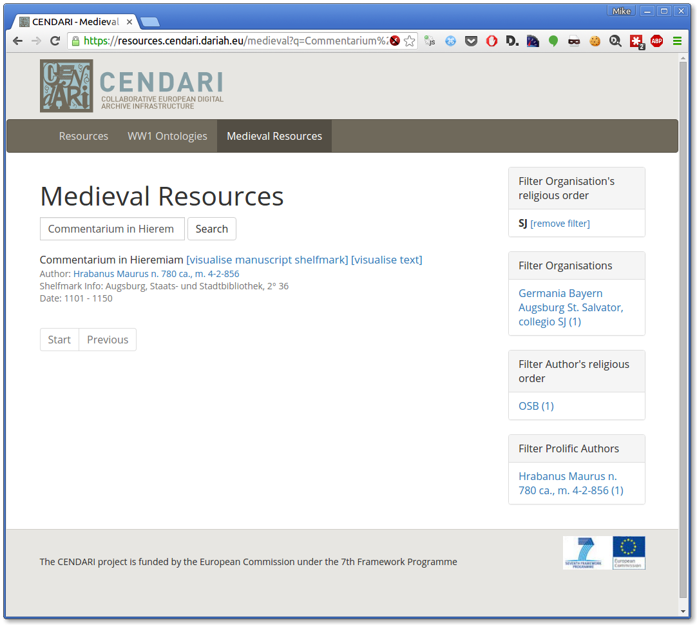

PINEAPPLE
=========

`PINEAPPLE <http://resources.cendari.dariah.eu>`_ is a simple browser for the CENDARI semantic repository.

1. What is it?
--------------

PINEAPPLE provides a browsing interface for three types of data in CENDARI's semantic repository:

 - WW1 archival data
 - WW1 ontologies
 - Medieval manuscripts  

2. How to use PINEAPPLE
-----------------------

**Resources search**

Supplying a textual query will filter resources by the contents of their plain text field.

The resource detail view displays its plain text content and semantically-related people, organisations, locations, and events.

Other resources which share access points are also listed below.

**WW1 ontologies search**

The ontology view allows exploring the WW1 ontologies used by (or developed for) CENDARI. Ontology items can be faceted
by item type (person, place, event, concept etc) and the ontology to which they belong. Providing a textual query
filtered the ontology items by their (English) preferred label.

The ontology item detail view displays both other ontology items related by semantic links, and CENDARI resources which
contain a textual match to the item's preferred label.

The detail view also displays information about the ontology to which the item belongs.

**Browsing medieval resources**

The medieval resources view allows browsing and faceted search for medieval manuscripts. 

Results can be narrowed by filtering on facets such as manuscript author, organisation, and the religious order of the
author/organisation.

