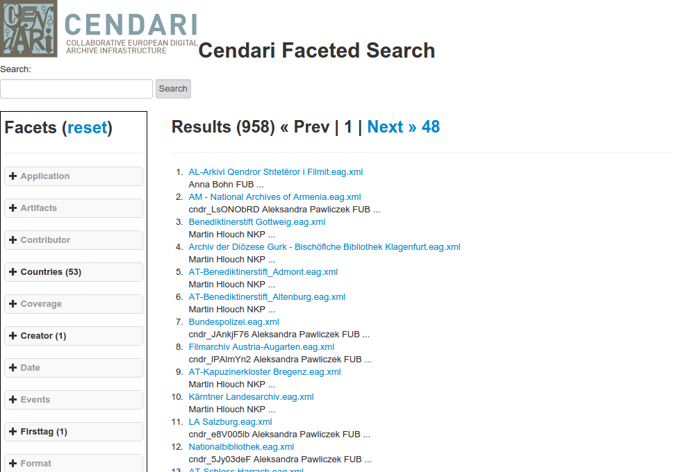

Searching
=========================

Faceted Search with CENDARI is provided by XMLFacets.

The Search interface.
---------------------

When navigating to the CENDARI faceted search, the user will be presented with the main search interface.

   The Search interface.

Using the facets
----------------

On the left of the screen, the user is presented with the available list of facets.
Any active (not greyed out) facet can by opened by clicking the plus symbol.
Then select the entry you want to choose.

   The image show the results after selecting *Bosnia and Herzegovina* from the country facet.

Click the reset button on the top of the facet panel to return to the start.

Viewing a file.
---------------

Selecting a search result takes you to the corresponding entry.

   The EAD file for *The Gdansk Library of the Polish Academy of Sciences*.

.. index::
   single: facet

