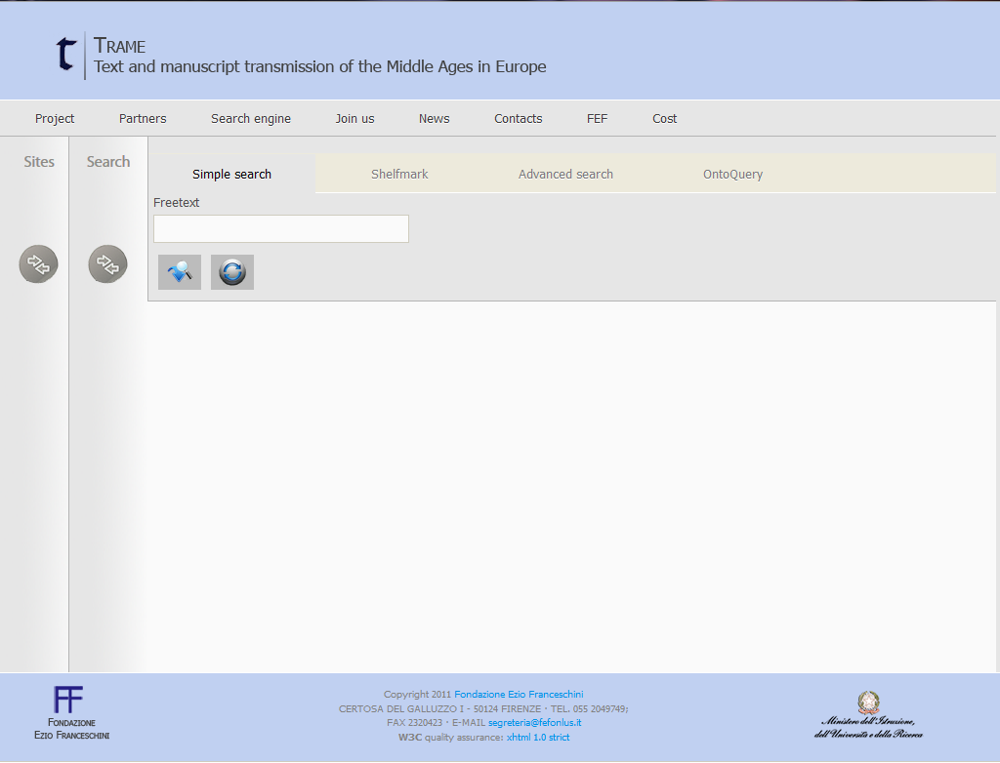

TRAME
======

`TRAME <http://git-trame.fefonlus.it/index.html>`_ (Texts and Manuscript Transmission of the Middle Ages in Europe) is a research infrastructure project for the development and interoperability of web databases about medieval manuscript tradition.

1. What is it?
-----------------

TRAME is an acronym
TRAME is a metasearch tool for medieval manuscripts, hosted by the Fondazione Ezio Franceschini and SISMEL. It aims to assist users in finding primary sources for the study of medieval culture.
Originally developed in 2011 to allow a combined search 
on a group of different Italian repositories and databases,
it has increasingly widened its scope to become a global
research infrastructure for all scholars of the Middle
Ages. Its main aim is to build a research infrastructure
that focuses on promoting interoperability and fostering
discoverability among the different digital resources
available in the medieval digital ecosystem.
Since 2014 TRAME has focused primarily on extending
the meta-search approach to other web resources, using
the user’s interaction with the research tool in an attempt
to define a medieval manuscripts ontology, and redesigning
the portal with the aim of improving the
accessibility and usability of the site.
Currently it implements a number of features (including
simple search, shelf-mark search, and advanced search)
on more than 80 selected scholarly digital resources
devoted to western medieval manuscripts, authors, and
texts across the EU and USA. These resources include
digital libraries, research databases and other projects
from leading research institutions.
TRAME is a research tool rooted in the international
medieval scholarly community and an ongoing
collaborative international effort. Its development is in
line with the Memorandum of Understanding of the COST
Action IS1005 “Medieval Europe Medieval Cultures and
Technological Resources”, representing 260 researchers
coming from 39 leading institutions in 24 countries
across the European Union.

2. What can I find there?
--------------------------

TRAME allows the user to search simultaneously in library
catalogues, project databases and research portals. It
combines online resources that are inside the TRAME
network as well as external sites. The infrastructure
combines both:

**Bibliographies pertaining to manuscripts, e.g.**

* MEL – Medioevo latino. Bollettino bibliografico della cultura europea da Boezio e Erasmo (secoli VI-XV)
* MEM – Medioevo musicale. Bollettino bibliografico della musica medievale
* TLION mss – Bibliografia dei manoscritti citati in rivista
* BibMan – Bibliografia dei manoscritti in alfabeto latino conservati in Italia

**Repertories of texts and manuscripts, e.g.**

* LIO – Repertorio della lirica italiana delle Origini
* BAI – Biblioteca Agiografica Italiana
* MAFRA – Repertorio dei manoscritti gallo-romanzi esemplati in Italia
* MAGIS – Manoscritti agiografici dell'Italia del Sud
* IRHT – Jonas : Répertoire des textes et des manuscrits médiévaux d’oc et d’oïl - JONAS
* Ramon Llull Database
* Repertorium Biblicum Medii Aevii
* BHL Biblioteca Hagiographica Latina manuscrita

**Catalogues of manuscripts (with images), e.g.**

* CODEX – Inventario dei manoscritti medievali della Toscana
* MDI – Manoscritti datati d'Italia
* Manuscriptorium
* Enluminures

**Repertories pertaining to the history of traditions, e.g.**

* TETRA – La trasmissione dei testi latini del Medioevo
* TLION – Tradizione della letteratura italiana online

**Bio-bibliographies**

* BISLAM – Bibliotheca Scriptorum Latinorum Medii Recentiorisque Aevi
* CALMA – Compendium Auctorum Latinorum Medii Aevi (500-1500)

**Library catalogues, e.g.**

* Beinecke Digital Collections
* Bodleian Library
* Bibliothèque nationale de France
* Trinity College
* Bayerische Staatsbibliothek
* Hill Museum & Manuscript Library
* Munchen (BSB) - MDZ
* Early Manuscripts at Oxford University
* Bibliothèque Municipale de Lyon
* Mazarinum - Les collections numeriques de la Bibliotheque Mazarine - Mazarinum

3. How to use TRAME
--------------------
**Site Selection**

.. only:: html
  
   .. raw:: html

      <iframe width="540" height="315" src="https://www.youtube.com/embed/_uXPH5WK9hU" frameborder="0" allowfullscreen></iframe>

.. only:: latex

   The introductory Video to TRAME: Site selection has been published on `Youtube <https://www.youtube.com/watch?v=_uXPH5WK9hU>`_.

   

**Simple Search**

.. only:: html
  
   .. raw:: html

      <iframe width="540" height="315" src="https://www.youtube.com/embed/mXE-dXraL0E" frameborder="0" allowfullscreen></iframe>

.. only:: latex

   The introductory Video to *TRAME: simple search* has been published on `Youtube <https://www.youtube.com/watch?v=mXE-dXraL0E>`_.
   
   
   
**Shelf-mark search**

.. only:: html
  
   .. raw:: html

      <iframe width="540" height="315" src="https://www.youtube.com/embed/_uXPH5WK9hU" frameborder="0" allowfullscreen></iframe>

.. only:: latex

   The introductory Video to *TRAME: Shelf-mark search* has been published on `Youtube <https://www.youtube.com/watch?v=_uXPH5WK9hU>`_.
   
   
   
**Advanced search**

.. only:: html
  
   .. raw:: html

      <iframe width="540" height="315" src="https://www.youtube.com/embed/3qrFDSFucNs" frameborder="0" allowfullscreen></iframe>

.. only:: latex

   The introductory Video to *TRAME: advanced search* has been published on `Youtube <https://www.youtube.com/watch?v=3qrFDSFucNs>`_.

  
  
4. TRAME version 2
---------------------
A completely revised TRAME user
interface is currently in development.
Not all of the search functions are
already operational.
In the new version of `TRAME 2 <http://git-trame.fefonlus.it/trame2/>`_ you can
perform searches as a normal user or as
a registered user. The main difference is
that as registered user you can build and
save your own searches in ‘search
packages’ (meaning your own selection
of databases). You will have the
opportunity to makes these packages
public, so others can use them, or to
keep them private.
The search options remain the same as
in the old version: a simple or freetext
search, shelf-mark and advanced search.
At this at this stage the only search fully
working is the freetext.

**Video User interface TRAME 2**

.. only:: html
  
   .. raw:: html

      <iframe width="540" height="315" src="https://www.youtube.com/embed/ohKHD3ycr2E" frameborder="0" allowfullscreen></iframe>

.. only:: latex

   The introductory Video to *TRAME 2: Interface* has been published on `Youtube <https://www.youtube.com/watch?v=ohKHD3ycr2E>`_.
   

5. Technical Background
---------------------------

TRAME’s development has been influenced by changes
regarding the nature of information available in the
WWW. TRAME has developed from a basic meta-search
approach towards an attempt to establish a Medieval
Semantic Knowledge base, by using custom applications
for information collection and integration (i.e.: web
crawler, data miner).

The application is written in OO-PHP, the design follows
the MVC Pattern, the RDBMS is MySql and the front-end
combines Xhtml and Javascript.

The search engine scans a set of sources for searched
query terms and retrieves links to provide a wide range of
information, including simple references, detailed
manuscript record, and full-text transcriptions.

Currently, it is possible to perform queries by freetext,
shelf-mark, author, title, date, copyist or incipit, on more
than 80 selected scholarly digital resources across the
EU and the USA.

**Advantages of TRAME’s search of remote resources:**

* TRAME has light and flexible infrastructure, as both data indexes are not stored in a central database. Actually no information is stored except for a few technical metadata.
* TRAME will send the user query across a vast number of repositories and present the results in a single list.
* TRAME can send a user query across a number or remote systems over HTTP protocol, it’s also supporting OAI-PMH on selected repositories and (if available) specific APIs
* The results will be divided in groups according to their provenance or type (the original data provider)
* All search results found by TRAME’s meta-search engine are accessible via the original provider’s web site, with their own policies and licensing methods
* A user query is sent simultaneously over a wide number of connected systems in order to collect a unique list of results. The search results will have all the information needed to identify each individual manuscript, such as localization (City, Library and Holding), shelf-mark and the link to the actual digital resource (URI: uniform resource identifier)

To learn more about the technical background of TRAME and TRAME 2 please have a look at the source code documentation.

7. Manual for the use of the Archival Directory AtoM
------------------------------------------------------

Within the CENDARI project, an electronic Archive Directory of sources for medieval and modern history was set up to establish descriptions of holdings, collections, records, and single items. The software used was AtoM or Access to Memory. It aims to be user-friendly and checks the quality of the descriptions thanks to mandatory fields. Explanations guide users through the process of creating an archival description. It stores the content in the standardized format Encoded Archival Description (EAD), which can be later exported. This archival standard is used in almost all European and many non-European countries. It is approved by the International Council on Archives (ICA), the institution that collaborated in the development of the AtoM software. AtoM is free web-based application, and as a multilingual multi-repository interface and database for archival descriptions, all elements in AtoM can be translated into multiple languages (using the translation interface). 

The CENDARI project has a strong transnational focus, and one of its goals was to include many archives and institutions which are little known or rarely used by researchers. It is focused on archives and libraries containing documentation for historical research on the Middle Ages and World War One. The CENDARI Archival Directory AtoM can be accessed both directly from the website and indirectly via the link in the Note-Taking Environment (NTE). The CENDARI Archival Directory AtoM contains entries for archival descriptions and institutions. A basic FAQ is available to assist users who are browsing and searching for archival descriptions and collections. Information is also provided on creating and editing entries. 

**What is an archival description?**

For all historical research, any historical source needs to have indications on the context in which it was created and distributed. Moreover, it should have information regarding its history – its use, storage and authenticity. Usually, cultural heritage institutions (archives, libraries and museums) possess the legal authority to give an account on the credibility and reliability of source material they are responsible for. Their catalogues and finding aids contain the necessary information on the subject of single holdings and record groups, integrating essential explanations on how to use any given inventory and how to interpret its contents. 

AtoM uses the standardized format Encoded Archival Description (EAD) to present information about an archival unit, which can range from a huge collection to an individual item in an archival institution. The International Council on Archives (ICA) defines an International Standard Archival Description (General) (ISAD(G)) as “The creation of an accurate representation of a unit of description and its component parts, if any, by capturing, analyzing, organizing and recording information that serves to identify, manage, locate and explain archival materials and the context and records systems which produced it. This term also describes the products of the process.” 

This standard can contain twenty-six data elements, of which six are mandatory in the creation of a compliant archival description. Following ICA rules, the obligatory elements are:

* **Reference code**: identifies uniquely the unit of description and provides a link to the description that represents it. To assist international standardisation, it needs to contain the country code, the repository code and a specific local reference code, control number, or other unique identifier. 
* **Title**: this is the name of the unit of description. It can either be the formal title or an abridged title (as long as the latter follows national conventions and the rules of multilevel descriptions.
* **Date(s)**: this records the date(s) of the unit of description. It can be either a single date or a range of dates, as appropriate. The date(s) is either the data when the records were collected or when they were first created.
* **Level of Description**: identifies the level of arrangement of the unit of description. For example, it is a single item, a file, sub-series, series, sub-fonds or fonds.
* **Extent and Medium of the Unit of Description (quantity, bulk, size)**: this element identifies and describes the physical or logical extent of the unit in Arabic numerals (and unit of measurement) and the medium of the unit of description. For example: one folder, containing 73 items.
* **Name of creator**: identifies the creator or creators of the described unit.
* **Repository**: This is not an official mandatory field in the ISAD(G) standard, but it is a mandatory field in the standard developed and used in the Archival Directory.

Here is an **example** of these mandatory fields in an archival description in the Archival Directory:

	Reference code: GB Add MS 49683-49962 

	Title: The Balfour Papers

	Date(s): 1868-1936 

	Level of Description: Collection

	Extent and medium: 280 items

	Name of creator: Arthur James Balfour

	Repository: The British Library

This archival description also contains non-mandatory elements such as Scope and Content, Language of material, Finding aids, Name Access Points and Archivist’s note. 

The ISAD(G) standard is not obligatory and it does not reflect practice in all archival institutions. When the idea of an international descriptive standard was first put forward, there was debate on whether such a standard was really necessary. The advent of computerised description, digitisation and digital finding aids that cover multiple archival institutions has strengthened the idea that a standardised methodology for describing archival units is very useful. 

The International Council on Archives Committee that developed the ISAD(G) recognised that all archival institutions are very different, and that their arrangement and subsequent archival descriptions will reflect different needs, whether these are organisational, national, or cultural. The ISAD(G) should be used in conjunction with national standards or as a basis for further development of existing national standards.

**Useful links**:

* International Council on Archives on ISAD(G) (it also includes accepted translations of all of the terms).
* International Council on Archives Committee on Descriptive Standards.
* UNESCO Archives Portal (provides information on archival institutions all over the world).
* International Standard Archival Authority Record. For Corporate Bodies, Persons and Families http://www.icacds.org.uk/eng/ISAAR%28CPF%292ed.pdf.
* ISDIAH: International Standard For Describing Institutions with Archival Holdings https://wiki.ica-atom.org/RS-3#4.7.

**What is an archival institution?**

Every archival description in the Archival Directory is linked to an archival institution entry. An archival institution has been defined as “an institution holding legal and physical custody of noncurrent documentary materials determined to have permanent or continuing value. Archives and manuscript repositories are archival institutions.”  This includes all institutions that manage, preserve and/or store historical source materials. The International Council on Archives has developed an international standard to describe archival institutions: ISDIAH (International Standard for Describing Institutions with Archival Holdings). It has also developed a standard to describe corporate bodies, persons and families as units within an archival descriptive system: ISAAR (International Archival Authority Record for Corporate Bodies, Persons and Families). Detailed documentation on these standards can be found on the ICA’s website.

The holdings can cover a diverse range of materials, including:

* Documentary material, which can be divided into:
	a) Printed material: most printed material is not kept in archival institutions but in libraries.For various reasons, such as rarity, historic importance, limited print run, and age, such material may be preserved in archival institutions (for example: pamphlets)
	b) Manuscripts: All archival material that is written by hand or typewritten. Can be bound or unbound, and cover a wide variety of genres (letters, handwritten books, etc)
* Audiovisual material: sound recordings, which might appear in a variety of formats
* Iconographic material: this can cover maps, plans, drawings, sketches, paintings, postcards, posters, and advertising material.
* Objects 

Unpublished archival material can be found both in archives and special collections in libraries. For example, both might contain bound and unbound manuscript material. Along with libraries and archives, museums are also considered to be memory institutions. While they may not hold documentary material, they hold objects which are historical sources. 

Regarding medieval archival materials, due to various historical factors related to the dispersion of materials, individual bound manuscripts are usually found in special collections in libraries (example), while documentary material, often unbound, (for example, court rolls, accounts, charters, etc) are found in archives. Regardless, both are considered technically archival institutions in the Archival Directory.

The Archival Directory was set up as a component of the CENDARI research infrastructure in order to pursue two goals. Firstly, to give visibility and accessibility to many archival institutions and their holdings which did not have a digital representation along with enabling the CENDARI team to establish entries for archival descriptions and institutions according to the methodology and criteria established by the team members. And secondly, to allow further users of the CENDARI virtual research environment to easily create archival descriptions with the help of a user-friendly tool and thus broaden the basis of digitally available descriptions of archival content.

**How the CENDARI Archival Directory AtoM can be used**

The CENDARI Archival Directory AtoM can be a very useful tool for historians researching in any archival institution. As AtoM provides an intuitive user interface, its archival forms can be used as a sort of registry, where the researcher can record information on the archival institutions and collections. However, as the CENDARI AtoM is a web-based application, the institution where the historian is researching needs to have an internet connection.

An increasing number of archival institutions offer researchers electronic finding aids. These describe specific collections, including information related to both the archive’s structure and content. Common descriptive fields are creator, date of creation, medium and extent, languages and system of arrangement. Other collection guides can be internal archival guides (focusing on collections of special interest) or shared spreadsheets. If none of these sources are available, it is best to request advice directly from the archivist, who would have detailed knowledge of the collections available in the archive as well as their structure and order. The archivist might also give the researcher access to resources that are only available off-line or after submitting a written request. It is highly recommended to contact the archivist when researching in a cultural heritage institution and before creating archival descriptions in the CENDARI Archival Directory. 

There is a distinction between modern and medieval sources in the "Archival Description" field in AtoM. Modern sources are usually grouped in collections or fonds, as most modern sources such as documents or registries are grouped in large numbers. Medieval sources are usually grouped in collections or fonds when they involve documentary material and usually found in archives. Medieval sources of authored texts, in manuscript format, are usually found in special collections in specialist libraries. An example of the former can be found in the ARG Dispersed Medieval Monastic Archives in Florence, which documents manuscript materials in archives. Meanwhile the ARG Italian Vernacular Bibles details individual manuscripts in codex format in libraries (Special Collections). 

Apart from using AtoM to search and create archival descriptions and collections, the CENDARI Notes Taking Environment (NTE) allows researchers to upload images such as scans or photographs of the documents. These can be analysed in a private virtual working space, with the possibility to annotate and describe them. This allows the user to access, in a digital working environment, both the reference to the examined archive and collections, and the photographed items, which can be transcribed and tagged in the NTE. 

This is possible because all the data – manually established data in AtoM as well as data provided by cultural heritage institutions – were brought together in the repository. In other words: All the data contained in AtoM is migrated to the repository on a regular basis. The automatic indexation of the named entities contained in the archival descriptions, like names, places and dates, enhances the search possibilities offered to the users in the Note Taking Environment. As an example: the results of a search for person in the repository will show all related hits from both manually and automatically ingested data, along with all hits from the ontologies. These search results would included the people, places and dates related to the individual subject of the search.

		image

Remember that in uploading photographs, scans or digitized objects into the CENDARI Notes Taking Environment, users have to stick to the terms and conditions provided by the CENDARI project; moreover, it is good practice to discuss this intention with the archivist, and if necessary to request a formal permission to the archive. 

Please note that CENDARI does not have any specific agreements with any cultural heritage institution (archives, libraries and museums). Cultural Heritage Institutions and users can add descriptions according to their needs to the Archival Directory, as long as they observe International Council on Archives standards. If users wish to publish their archival descriptions and their search results from Archival Directory, they should discuss relevant permissions with the archive in question. Similarly, it is strongly recommended that there should be a clear agreement between the archive and the researcher before any material is uploaded to the Note Taking Environment.

**Adding archival institutions to the CENDARI Archival Directory**

Important information can be found in the descriptions of archival institutions. These descriptions consist of seven fields (called :menuselection:`areas`): 

Identity area
Contact area
Description area
Access area
Services area
Control area
Access points 

The Identity area lists the institution’s formal names. The Contact area provides contact information as well as street addresses, locations of reading rooms, etc. Official websites of archival institutions can give further information, and the researcher can also directly contact the archivists (via mail, telephone call or on site in the reading room). This information is available in the Access areas, for example information on “Opening times”.

The **Description area** of archival institutions contains information on the history of the archival institution (“History”), their most important collections (“Archival and other holdings”), information on finding aids, guides and publications (in the corresponding fields). Additionally researchers can find information about the geographical and cultural context of the holdings and on the archival institution’s records management and collecting policy (in the corresponding field).

Within the **Services area** a user can learn more about research services provided by the institution. If a user aims at providing information in this field, he can write down information over here like, for example, whether you can speak English with the archivist, who can advise you on-site, computer facilities, etc. In the field “reproduction services” information can be provided on facilities are available to researchers such as the possibility of photocopying or scanning materials, fee information, internal archival regulations, etc. 

The sub-area **Public area** provides useful information to facilitate research and the time spent in the archival institution. For example, if the internet connection is free or there is a charge, existence of cafeterias or restaurants, or if cash machines are available inside or nearby the institution.

Due to lack of existing data, many archival institutions have empty fields in their descriptions in the Archival Directory. CENDARI users are welcome to contribute updated information on the archival institutions to the aforementioned fields. 

The Archival Directory AtoM provides users with the possibility to edit and publish new archival institutions and archival descriptions. However, these possibilities are limited by the users’ rights. This has been done in order to ensure the quality of the archival descriptions. A user can only add archival descriptions once they have a DARIAH-account, been authenticated and granted contributors’ rights. Users who have not logged into the CENDARI Archival Directory (“researchers”) have view-only access. Contributors’ rights allow a user to read, create, or edit archival descriptions. However they do not allow the user the ability to delete any archival description nor create a record for a new archival institution. This can only be done by users with editors’ rights. A user with editor rights might be the mentor (a historian, librarian, archivist or someone with similar experience) of a user with contributors’ rights, who is not yet familiar with the software AtoM or with the establishment of archival descriptions.

A user with editor rights can create records for archival institutions. To add a new archival institution, click on the ‘Add button’ (the plus sign symbol) in the top right hand side of the Archival Directory AtoM. When you start filling the fields explanations will appear below each field. Information should be placed into the field in the accordance with the international standard ISDIAH, and users are requested to stick to them.

**Adding archival descriptions**

Archival descriptions should be added in accordance with the International Council on Archives ISAD(G) standard. In order to their archival descriptions freely accessible to all Archival Directory viewers, the user would need to contact a user with editor rights. The user with editor rights will check the quality of the submitted archival descriptions and then can change the archival descriptions’ status from 'draft' to 'published'. 

To create an archival description, click on the ‘Add’ button on the top right (represented by a plus symbol) and select ‘Archival Description’. The user can name their archival description, which is initially designated ‘Untitled’ at the top of the page until changed by the user. 

The areas are:

**Identity Area**, which includes:

* Identifier [mandatory] This should be a specific local reference code, control number, or other unique identifier. The country and repository code will be automatically added from the linked repository record to form a full reference code. Alternative identifiers can be added if desired (http://www.worldcat.org/webservices/registry/xsl/identifiers/).

**Title [mandatory]:**

* This can either be a formal title or a concise title according to the rules of multilevel description and national conventions.
	* Date(s) [mandatory]
	* Level of description [mandatory]
	* Add new child levels [optional]
	* Extent and medium [mandatory]

**Context Area**, which includes:

* Name of creator [mandatory]
* Repository [optional]
* Archival History [optional]
* Immediate Source of Acquisition or Transfer [optional]

**Content and Structural Area**
 
**Conditions of Access and Use area**

**Allied Materials Area**

**Notes area**

**Access points**

**Description Control area**

**Rights Area**

**Administrator Area**

**Links to digitized objects**

**Multilinguality of the Archival Directory**

Many archival institutions in the Directory were described with names in Russian, Ukrainian, Lithuanian, etc. The original name can be seen in the identity area (the field “Authorized form of name”). The translated name of the same institution (usually in English) is available in the next field “Parallel form(s) of name”. This field can also contain different forms of authorized names. For example, there can be provided abbreviations and acronyms of institutional names. For example, in a search, typing the Latin letter form “GARF” will bring up as a result the State Archive of the Russian Federation. Typing in the Cyrillic “ГАРФ”, will bring up the same institution (Государственный архив Российской Федерации)

In the title field for archival collection descriptions in some Eastern European archival institutions, the name of the archival unit is available in both English and Russian. For example:

* Fonds 601 - Nicholas II of Russia / Николай II

When adding new descriptions, it is best to enter the original language the institution’s proper title and the descriptions of their archival holdings, along with inputting an English translation of the titles. This will help future searches. 

**Using the Notes area **

The :menuselection:`Notes area` allows the user to add annotations according to their individual research interests. Users can inform the CENDARI community about important details regarding the archival collections. For example, the researcher’s experience of working with this collection, on-site or personal discoveries which could be useful and interesting for other users, etc. Every user can open a new note for his annotations by clicking on “Add new”. The notes should be accurate and understandable for other researchers. Editors monitoring the content may not accept notes if they do not correspond to the relevant archival descriptions. 

	image

**Uniting dispersed sources of the same institutions or persons **

The dispersion of sources poses a major problem for historical research. Different tools are available, so that extensive travel might now always be necessary in order to find and describe sources. There on-line archival catalogues, databases, blogs, email expert advice, and projects such as as CENDARI. Archival sources can be found in unexpected places, for example, among the papers of secret services, state organizations or private papers, which might be in the process of being described and digitised. Some previously top-secret files may be declassified.

To discover archival collections, the researcher should be familiar with the history of its creators. Help can be provided by both primary sources (published collections) and secondary sources (encyclopedic entries, thematic monographs and articles).

**The case of Jewish archives: the American JDC archive**
	
Jewish sources are scattered across different countries and various cultural heritage institutions (Jewish archives, national and regional archives, national libraries, museums, etc.). Due to wars, migrations and deportations the Jewish archives were dispersed and even split among different countries. For example, the records of the American Jewish Joint Distribution Committee (JDC) can be found in different institutions of Eastern Europe, America, and Israel. This organization operated in over 90 countries. Their main task was to bring urgent aid to Jewish communities as well as to individuals in need, including refugees, orphans, POWs and other groups. The activity of the Jewish Joint Distribution Committee was very important after 1914, when the JDC was involved in charitable activities in the warring countries and later in the newly established states of Central and Eastern Europe (Poland, Lithuania, Hungary and others). In the 1920s the JDC supported programs such as medical assistance, training and resettlement of Jews from shtetls, in the Soviet republics until its activity was stopped by the Soviet regime during the years of the Great Terror (1937-1938).

