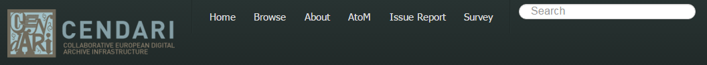
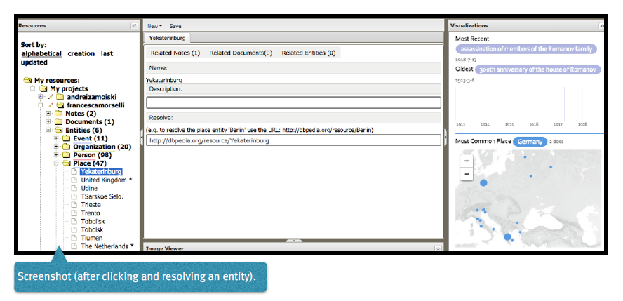

Working with the NTE
=====================

.. image:: ./images/TUG_01.png

1. Creating a new project
-----------------------------

**Establishing new projects**

If you want to create a new project, click on the :menuselection:`New`-tab on top of the middle pane of the NTE’s main window; select :menuselection:`project` from the drop-down menu and click it. You are directed to a page where you have to provide for a name of this new project. Please be aware that you will be shown an error message if a project with the identical name already exists. After having provided the name of the project, click :menuselection:`Save`. Afterwards this project can be shared with every user available in the list of usernames on the project edit page; the latter can be reached by clicking on the pencil in front of the project name.

**Aliases for projects**

If you like, you can add a new name for a project. Go to the project edit page by clicking on the pencil in front of the project name. Scroll down on this page until you reach the very bottom. You will find there the label :menuselection:`New Alias:` and beneath it a field where you can provide for a new name (alias) of this project. Afterwards click on the :menuselection:`Add` button below the field for the new name. The alias is provided and a link containing this alias of the project is being displayed.

**Publishing your project**

If you want to make your project publicly accessible – i.e. enable every user of the internet to access it without prior log-in – you have to go to the project edit page by clicking on the pencil in front of the project name. Scroll down on this page until you reach the bottom. You will find there the label :menuselection:`Is public:` and beneath it a check box. If you tick it and click on :menuselection:`Save` afterwards, the project will be displayed in the :menuselection:`Public projects` folder available at the bottom of the resources panel (west pane). 

2. Create and edit content
------------------------------

**Create a Note**

To create a new note, click :menuselection:`New` in the Menu Bar and
then :menuselection:`Note`. Write your file’s title into the field :menuselection:`Note's
title`. Write some content in the main body of the note
(this can be a short as one word such as :menuselection:`test`, as a note
without content cannot be saved). Click on :menuselection:`Save` (a green
bar should appear), and you can continue working. Please be aware that you will be shown an error message if a note with the identical name already exists.

**Creating a table of contents**

To structure your note, type the headings and elements of
your note into the text. Then mark each heading one by
one and choose the appropriate heading from the editor’s
drop-down menu. Keep to the correct order: heading 2
follows heading 1 and so on. Click on :menuselection:`Save` and a table of
contents will be created. You can view it in the :menuselection:`Read
mode`. For example, many of the CENDARI ARGs have the
following table of contents:

* Title, Authors, Abstract
* Introduction
* Major Research Questions
* Primary Sources
* Secondary sources
* Additional sources

**Creating a table**

Go to the point in the text where you plan to insert a
table. Click on the :menuselection:`Insert --> Edit Table` button (second row,
far left of the editor). This will bring up a pop-up menu in
which you can select how many rows and columns are
needed, in which position the table should be placed (for
example, to the right or left of the text). Click on :menuselection:`Insert` to
create your table. If your cursor is over the table, you can
select other options from the editor (second row) such as
:menuselection:`Insert row before` or :menuselection:`Insert row after`. For borders and
other options on your table, cluck again on the :menuselection:`Insert -->
Edit Table` button and choose the :menuselection:`Advanced` table. In
this drop-down menu you can select the border in the line
:menuselection:`frame`, select the colour and then click on :menuselection:`Update`. Save
again and chose :menuselection:`Read mode` and all of the selected
options will be displayed.

**Saving Work**

Please save all of your work and log yourself out after
finishing a session. It is a good idea to regularly save work
in the NTE.

**HTML**

If you have experience with editing in HTML Source Code,
you can click on the :menuselection:`html` button in the first row of the
editor. In the pop-up window you can edit code and save
it with :menuselection:`Update`.

**Image Viewer**

The image viewer is meant to transcribe scans; it can be used after having established a document in your project. The image viewer is to be found on the bottom of the middle column (split screen). You can use it if you click on the 'Scans' tab and upload and select one of the image presented there by clicking on it. Afterwards this image is presented in the Image Viewer below. You may need to scroll down and open the :menuselection:`Viewers` tab. The image can also be viewed in a separate browser tab, by clicking on the expand button (on the top right corner of the :menuselection:`Image` viewer pane). Via the :menuselection:`Scans`-tab several multimedia file formats can be uploaded: png, jpeg, tif, tiff, mp3, avi, doc, pdf.

**Faceted Search**

On top of the main page of the Note Taking Environment NTE there is a search box. By typing a query in the search field, results from within the Note Taking Environment, from dbpedia entries and from TRAME, a database for medieval sources will be shown. There is a check box underneath the :menuselection:`include TRAME` checkbox, called :menuselection:`Search Current Project` for limiting the search to the current project. On the results page, the faceted search options are available. Please do filter the results according to your needs.

3. Insert functions
---------------------

**Inserting text**

You can simply type text into the editor as in any word
processing programme (using the buttons in the first row
of the editor). You can also copy and paste text from
another text file or from a wiki. You can layout your text by
marking it and choosing the layout options in the first line
of the editor. At the moment no images are accepted in
the Note Taking Environment, although this is due to the software being in a development phase and this feature
will soon be available. If you have copied and pasted text
into the editing window, you can automatically detect
links in the text by clicking on the big red button in the top
row of the editor (called :menuselection:`markcreativework.desc`). You
can also insert links manually by selecting a section of
text, and then clicking on the :menuselection:`chain` button in the editing
menu (called :menuselection:`Insert --> Edit Link`).

**Insert images**

You can add images to your notes by moving the cursor to the place in the text where you want to insert the picture, and then click on the small icon with the tree (in the second line of the menu of the editor, to the very left). A window opens; to the right of :menuselection:`Image URL` there is an icon :menuselection:`Browse`. By clicking it you can upload images from your computer. In the tab :menuselection:`Appearance` you can tell the system to put the image to the right or left side and to display it smaller than the original size (f.ex. you put the value 300 into the left box and keep the :menuselection:`Constrain Proportions` box ticked, then the image will be displayed smaller - in this case 300px, which is around 10cm).
The NTE will also provide users with the possibility to upload images in a separate folder, under :menuselection:`Documents`. To add a document go to :menuselection:`New` and click on :menuselection:`Document`. Then type in the description of the document you want to add and click ‘Save’. The description will become the title of your document. Next you can add your document by going to the 'scan' tab at the top of the page and choosing the right file to upload. After uploading the scan, save your document again. In the near future, it will be possible to use the viewer function at the bottom of the page, allowing you to examine your scans closely and for example to work on a transcription in the NTE.

**Insert Footnotes/References**

Go to the end of your text. If there is no reference section
there, create it first by marking it as you did when creating
headings. Click on the button with an anchor and provide
a name of the anchor. Make sure that this is either one
word, words with no spaces in between, or words with
hyphens or underscores. Click :menuselection:`Insert`. Then go to the
section in the text which you wish to link to the footnote.
Put the number of the footnote in brackets (i.e. [1]),
highlight the number and then click on the chain symbol
(:menuselection:`Insert --> Edit Link`). Select the named anchor from the
:menuselection:`Anchors` drop-down menu. Click :menuselection:`Insert` and then :menuselection:`Save`.
In the Read mode the link will work. You can do the same
vice versa so that the readers will be taken back to the
point in the text from the reference.

.. image:: ./images/TUG_02.png

4. Search functions
------------------------
The Faceted Search within the CENDARI infrastructure can be accessed through the Search bar in the main window in the top right corner of the Note Taking Environment.

**The search interface**

After having typed a search term into the search box, the user will be present the main search interface in a new tab.

  .. image:: ./images/search_02.png 

Users can type precise combinations of search terms by using the following symbols: + signifies AND; I signifies OR; - negates a single token; “ ” can be put around a phrase; * can be put as a placeholder at the end of a term for prefix; the symbols ( and ) signify precedence. Users can thus combine search terms and symbols according to their needs. Example: The combination of prisoners+of+war will render more precise search terms than the three words prisoners of war.

**Using the facets**

On the left side of the screen, the facets of the Faceted Search are being presented to the user. The user can narrow the results of his initial search by filtering them through the facets. Any facet can be opened by clicking the plus symbol. Afterwards the user can select the filter he wants to choose by clicking on it. In the screenshot below the user can choose whether the results from dbpedia, from the CENDARI repository (everything available there), results from the Note Taking Environment, or results from archives (only results in the international standard format Encoded Archival Description) should be displayed to him.
  
   .. image:: ./images/search_03.png 

The same applies to the other filters like f.ex. Artifact (results being a note or a document within the Note Taking Environment), Date, Format, Person etc. Filters can also be applied subsequently in order to narrow search results.

Finally, a user can determine whether or not to include the results of the medieval database TRAME or whether or not to limit the search to the current project from where the search was started. This is being done by ticking the check box in the appropriate field. 

   .. image:: ./images/search_04.png 

In order to return to the start, a user can click the reset button on top of the Facets panel.

   .. image:: ./images/search_05.png

**Saving the results of a search**

Generally, the results of a search will be displayed to the user as a list of links (displayed in blue with a check box in front of it). Users are provided with a link to the main repository and, if applicable, a link to the data provider. Beneath each link a snippet from the content can be found, i.e. the beginning of the information provided for the result.

Users can choose the results they consider relevant for their search by ticking the check box in front of the result.

   .. image:: ./images/search_06.png
 
A user can also decide to select all the results displayed on a page, or none of them, by clicking one of the fields displayed below.

   .. image:: ./images/search_07.png

After having selected all the results she is interested in, the user can copy them to his clipboard and f.ex. paste them into a note or a .doc-file. 

   .. image:: ./images/search_08.png
   
**Viewing a result**

A single search result can be viewed by clicking on the link. Depending on the result, this can be a dbpedia page, a file or a note or document in the Note Taking Environment, or, if applicable, a link to the provider. 
   
An example for a result from the German Bundesarchiv; the archival description is stored within the CENDARI repository: 

   .. image:: ./images/search_09.png

5. Named Entity Recognition and Disambiguation (NERD)
------------------------------------------------------

CENDARI provides for a multi-language Named Entity Recognition and Disambiguation service. This service locates and classifies entities in the text provided in notes and documents such as the names of persons, places, organizations, events. Using the service is quite simple: After having provided a text in a note or document, simply press the :menuselection:`Smiley` button in the toolbar of the editor. The service will process the text and find the possible entities contained. The results are being displayed in the text: Recognized entities receive a colored underlining. Please save the results by pressing the :menuselection:`Save` button. The recognized entities will be shown in the resources tree in the west panel. Afterwards you can go through your text and resolve entities manually or assign the appropriate entity class if they were not recognized correctly. 

6. Entity Management
---------------------

**Tagging of entities**

Highlight the entity you want to add to your resource.
Then right-click with your mouse and choose from the
context menu the appropriate entity, which can be a
person’s name, a place, an event or an organisation. Then
click on :menuselection:`Save`. Your entity will be listed in the :menuselection:`entities`
section on the left column, and will shown in the column
on a right. You can also view the entity by clicking on the
:menuselection:`entities` tab in your working space (top left-hand side).
Tagging entities allows them to be recognized by the
system and linked to the available database. You can add
an explanatory description to your entity if you right-click
with your mouse, as a drop-down menu will appear,
offering different options (for example :menuselection:`son of`).

**Resolving of entities**

If you want your entities to be tagged right-click the entity with
your mouse and choose from the context menu the
appropriate entity, as mentioned above. Then :menuselection:`Save`. To
resolve it, you can either click on the tab :menuselection:`Entities` in your
working space section or choose the :menuselection:`Entities` section in
the left column. After selected and clicking on the entity,
you have the option of a :menuselection:`Resolve` field. In this field you
need to provide a link.
Open a new tab in your Chrome browser and search for
the entity you are looking for in dbpedia. If the entity you
are looking for is simple – for example Paris –, the
easiest way is to guess the page’s URL by typing it after
http://dbpedia.org/page/
(i.e. http://dbpedia.org/page/Paris).
Click on the Enter bar of your keyboard, and press :menuselection:`Save`.
The resolved entity will then be shown on a map to your
right.
If the desired entity is a complex entity (for example a
transcribed name), the easiest solution is to go to the
corresponding `Wikipedia page <http://en.wikipedia.org/wiki/Leon_Trotsky>`_
choose the correct entry and then copy and paste the link
into the field :menuselection:`Resolve` in the NTE.
Afterwards replace the beginning of the link :menuselection:`http://
en.wikipedia.org/wiki` with :menuselection:`http://dbpedia.org/
resource/ --> Save`. In the right-hand column
the number of all related documents and notes will be
shown, and you see these documents by clicking on the
tabs in the middle of your working space (:menuselection:`Related notes`,
:menuselection:`Related documents`, :menuselection:`Related entities`).

**Auto-completion for the resolution of entities**

If you hover with the cursor over an entity, its colour changes to orange or yellow. If you click on it, a window opens where you can resolve or delete the entity (:menuselection:`Edit Schema.org Entity`); you can also change the entity type here. In order to have events resolved, you should provide an entity name in the first field. Over there an auto-completion service has been provided to help in the entity resolution process. If you type the first few characters of the entity name in the :menuselection:`Resolve` field, the NTE will suggest some dbpedia entries and fetch the url of the selected suggestion automatically. If the service does not find what you are looking for, you can always copy-paste a dbpedia link in the form http://dbpedia.org/resource/ENTITY.
Another way to resolve entities is to go to the :menuselection:`entities` section in the west panel. There is also an auto-completion service to help in the entity resolution process has been provided. 

**Manual Resolution of Events**

Provide a date for the event between square brackets in this format 'mm/dd/yyyy', that is month, then day followed by the year. For example, in a note or document, tag :menuselection:`Battle of Albuera [05/16/1811]` as an event. Then, press save. The NTE will reload the page and show the date of this battle on the timeline. To verify this, you can open the events folder from the resources tree (west panel) and locate the entity :menuselection:`Battle of Albuera [05/16/1811]`. Hovering over this event will highlight its date in the timeline. Note that resolved event entities do not have an asterisk (*) next to their names in the resources tree. If you do not provide a date between brackets [] or not in the correct format during the tagging process, the date will not be recognized and the entity will not be resolved. 

**Automatic Resolution of Events**

Create an event entity from a document or a note as before. You do not need to provide a date between brackets. Open the event you created (e.g.:menuselection:`battle of Wilkomierz`) from the resources tree. In the :menuselection:`Resolve` field, type the first few letters of the event and pick a suitable result from the suggested list. Press :menuselection:`save`. When resolving events automatically, the user has an option to check the date for an event from dbpedia after having found the event via the suggestions or after having provided the dbpedia link. This is done by clicking the :menuselection:`Search for dates` button in the entity form. If a date has been found then the user has the option to keep or discard this date. The NTE will try to fetch the date automatically from dbpedia. If a date exists and if its format is processable, then the entity will be resolved and its date assigned to the timeline. If there is no available date from dbpedia or the retrieved format is not in a recognisable format, a warning message is issued. This is a potential candidate for manual resolution (as above). Please note that events which have lasted for more than one day are not being displayed on the timeline. Also, hovering over the label for the date field shows a tooltip describing the date formats to be used for tagging dates in notes, documents and transcripts (i.e. %d/%m/%Y and %m/%d/%Y)

**Clustering**

Aliases are different names for the same entities. For example, the person *Lawrence of Arabia*, *T.E. Lawrence* and *Thomas Edward Lawrence* is the same individual. Similarly the terms *First World War*, *Great War* and *World War One* represent the same event. Another example would be different spellings for the same place in different languages and scripts, such as *Vilnius*, *Вильнюс*, *Вiльня* or *ווילנע*. So that the system knows that these different names point to the same entity, users can group them into a cluster. This can be done in two ways.
First, after having marked up these as entities in  a note or document as an entity, go to the list of resources in the left panel, and open the appropriate entity. Then resolve all of the entities by giving them the same dbpedia URL. For the T.E. Lawrence example, all three entities should be resolved with the URL http://dbpedia.org/resource/T._E._Lawrence. Entities with the same dbpedia URL will be automatically merged into an alias cluster.
The second possible option for giving aliases for all entities involves resolving only one of the entities with the appropriate URL. After doing this, click on :menuselection:`Save --> Create a new cluster containing this topic` which should be in the middle panel under the URL's field. Please note that you have to enable pop-up windows in your browser to access this page. A new page will open with the entity for which you want to create a cluster on top, followed by a list of all the other entities below. In order to select all the entities which should be grouped in the cluster (for example *Vilnius*, *Вильнюс*, etc.), you have to tick the boxes in front of these entities. Remember to click :menuselection:`Save` afterwards.
Both operations will result in the clustering of all related entities in a folder in the list of resources in the left-hand panel. You can edit clusters there if desired. Access the edit page of a cluster by opening one of the entity pages of the cluster  and click on the cluster name link in the middle panel, which is just below the field for the URL. Subsequently after opening the page, you can edit the name of the cluster or add and remove entities from the cluster. Always click on :menuselection:`Save` after having selected the appropriate boxes.

	
7. Versioning
-------------

**Versioning and Reversion History**

Open a note or a document, next to the save button you will find the :menuselection:`version history` button. Click on this button and you will see the latest versions for this document or note. You can check each of the old versions of these documents by clicking on the links.
Reversion History: the date of each history version of a document or a note is available now. Open a document, click on :menuselection:`Version History` button from the menu bar. The revision history is displayed in a new page. Select an old version, the content of this document version will be opened in the editor. You will notice next to :menuselection:`Document Description` the date (between brackets) when this version was created. The :menuselection:`Revert to this version` link next to :menuselection:`Document's description` allows for reverting the document to the selected history version. Note that revision history also works for notes.

8. Collaboration and Sharing
-----------------------------------

9. Reporting issues
----------------------

If something does not work or if the system crashes, you
can click on the button :menuselection:`Issue report` on the very top of
the page.

10. Frequently Asked Questions
------------------------------

**How can I invite other persons to work on an ARG together?**

**What happens with my feedback given via the issue report or the survey?**

**What happens to my data in several years? Will all my work be stored and how long will it be stored?**

