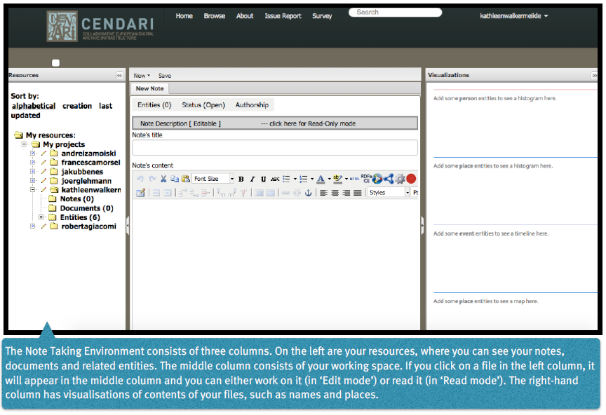
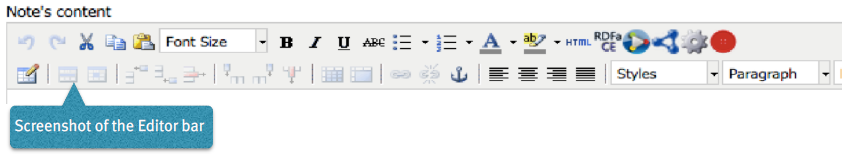

Working with the NTE
=====================

Create a Note
---------------

To create a new note, click :menuselection:`New` in the Menu Bar and
then :menuselection:`Note`. Write your file’s title into the field :menuselection:`Note's
title`. Write some content in the main body of the note
(this can be a short as one word such as :menuselection:`test`, as a note
without content cannot be saved). Click on :menuselection:`Save` (a green
bar should appear), and you can continue working.

Creating a table of contents
-------------------------------------

To structure your note, type the headings and elements of
your note into the text. Then mark each heading one by
one and choose the appropriate heading from the editor’s
drop-down menu. Keep to the correct order: heading 2
follows heading 1 and so on. Click on :menuselection:`Save` and a table of
contents will be created. You can view it in the :menuselection:`Read
mode`. For example, many of the CENDARI ARGs have the
following table of contents:

* Title, Authors, Abstract
* Introduction
* Major Research Questions
* Primary Sources
* Secondary sources
* Additional sources

Creating a table
----------------------

Go to the point in the text where you plan to insert a
table. Click on the :menuselection:`Insert --> Edit Table` button (second row,
far left of the editor). This will bring up a pop-up menu in
which you can select how many rows and columns are
needed, in which position the table should be placed (for
example, to the right or left of the text). Click on :menuselection:`Insert` to
create your table. If your cursor is over the table, you can
select other options from the editor (second row) such as
:menuselection:`Insert row before` or :menuselection:`Insert row after`. For borders and
other options on your table, cluck again on the :menuselection:`Insert -->
Edit Table` button and choose the :menuselection:`Advanced` table. In
this drop-down menu you can select the border in the line
:menuselection:`frame`, select the colour and then click on :menuselection:`Update`. Save
again and chose :menuselection:`Read mode` and all of the selected
options will be displayed.

Insert funtions
------------------

**Inserting text**

You can simply type text into the editor as in any word
processing programme (using the buttons in the first row
of the editor). You can also copy and paste text from
another text file or from a wiki. You can layout your text by
marking it and choosing the layout options in the first line
of the editor. At the moment no images are accepted in
the Note Taking Environment, although this is due to the software being in a development phase and this feature
will soon be available. If you have copied and pasted text
into the editing window, you can automatically detect
links in the text by clicking on the big red button in the top
row of the editor (called :menuselection:`markcreativework.desc`). You
can also insert links manually by selecting a section of
text, and then clicking on the :menuselection:`chain` button in the editing
menu (called :menuselection:`Insert --> Edit Link`).

**Insert Footnotes/References**

Go to the end of your text. If there is no reference section
there, create it first by marking it as you did when creating
headings. Click on the button with an anchor and provide
a name of the anchor. Make sure that this is either one
word, words with no spaces in between, or words with
hyphens or underscores. Click :menuselection:`Insert`. Then go to the
section in the text which you wish to link to the foonote.
Put the number of the footnote in brackets (i.e. [1]),
highlight the number and then click on the chain symbol
(:menuselection:`Insert --> Edit Link`). Select the named anchor from the
:menuselection:`Anchors` drop-down menu. Click :menuselection:`Insert` and then :menuselection:`Save`.
In the Read mode the link will work. You can do the same
vice versa so that the readers will be taken back to the
point in the text from the reference.

Entity Management
---------------------

**Tagging of entities**

Highlight the entity you want to add to your resource.
Then right-click with your mouse and choose from the
context menu the appropriate entity, which can be a
person’s name, a place, an event or an organisation. Then
click on :menuselection:`Save`. Your entity will be listed in the :menuselection:`entities`
section on the left column, and will shown in the column
on a right. You can also view the entity by clicking on the
:menuselection:`entities` tab in your working space (top left-hand side).
Tagging entities allows them to be recognized by the
system and linked to the available database. You can add
an explanatory description to your entity if you right-click
with your mouse, as a drop-down menu will appear,
offering different options (for example :menuselection:`son of`).

**Resolving of entities**

If you want your entities to be tagged right-click the entity with
your mouse and choose from the context menu the
appropriate entity, as mentioned above. Then :menuselection:`Save`. To
resolve it, you can either click on the tab :menuselection:`Entities` in your
working space section or choose the :menuselection:`Entities` section in
the left column. After selected and clicking on the entity,
you have the option of a :menuselection:`Resolve` field. In this field you
need to provide a link.
Open a new tab in your Chrome browser and search for
the entity you are looking for in dbpedia. If the entity you
are looking for is simple – for example Paris –, the
easiest way is to guess the page’s URL by typing it after
http://dbpedia.org/page/
(i.e. http://dbpedia.org/page/Paris).
Click on the Enter bar of your keyboard, and press :menuselection:`Save`.
The resolved entity will then be shown on a map to your
right.
If the desired entity is a complex entity (for example a
transcribed name), the easiest solution is to go to the
corresponding `Wikipedia page <http://en.wikipedia.org/wiki/Leon_Trotsky>`_
choose the correct entry and then copy and paste the link
into the field :menuselection:`Resolve` in the NTE.
Afterwards replace the beginning of the link :menuselection:`http://
en.wikipedia.org/wiki` with :menuselection:`http://dbpedia.org/
resource/ --> Save`. In the right-hand column
the number of all related documents and notes will be
shown, and you see these documents by clicking on the
tabs in the middle of your working space (:menuselection:`Related notes`,
:menuselection:`Related documents`, :menuselection:`Related entities`).

.. image:: ./images/TUG_03.png

**Auto-completion for the resolution of entities**

If you hover with the cursor over an entity, its colour changes to orange or yellow. If you click on it, a window opens where you can resolve or delete the entity (:menuselection:`Edit Schema.org Entity`); you can also change the entity type here. In order to have events resolved, you should provide an entity name in the first field. Over there an auto-completion service has been provided to help in the entity resolution process. If you type the first few characters of the entity name in the :menuselection:`Resolve` field, the NTE will suggest some dbpedia entries and fetch the url of the selected suggestion automatically. If the service does not find what you are looking for, you can always copy-paste a dbpedia link in the form http://dbpedia.org/resource/ENTITY.
Another way to resolve entities is to go to the :menuselection:`entities` section in the west panel. There also an auto-completion service to help in the entity resolution process has been provided. 

**Manual Resolution of Events**

Provide a date for the event between square brackets in this format 'mm/dd/yyyy', that is month, then day followed by the year. For example, in a note or document, tag :menuselection:`Battle of Albuera [05/16/1811]` as an event. Then, press save. The NTE will reload the page and show the date of this battle on the timeline. To verify this, you can open the events folder from the resources tree (west panel) and locate the entity :menuselection:`Battle of Albuera [05/16/1811]`. Hovering over this event will highlight its date in the timeline. Note that resolved event entities do not have an asterisk (*) next to their names in the resources tree. If you do not provide a date between brackets [] or not in the correct format during the tagging process, the date will not be recognized and the entity will not be resolved. 

**Automatic Resolution of Events**

Create an event entity from a document or a note as before. You do not need to provide a date between brackets. Open the event you created (e.g.:menuselection:`battle of Wilkomierz`) from the resources tree. In the :menuselection:`Resolve` field, type the first few letters of the event and pick a suitable result from the suggested list. Press :menuselection:`save`. When resolving events automatically, the user has an option to check the date for an event from dbpedia after having found the event via the suggestions or after having provided the dbpedia link. This is done by clicking the :menuselection:`Search for dates` button in the entity form. If a date has been found then the user has the option to keep or discard this date. The NTE will try to fetch the date automatically from dbpedia. If a date exists and if its format is processable, then the entity will be resolved and its date assigned to the timeline. If there is no available date from dbpedia or the retrieved format is not in a recognisable format, a warning message is issued. This is a potential candidate for manual resolution (as above). Please note that events which have lasted for more than one day are not being displayed on the timeline. Also, hovering over the label for the date field shows a tooltip describing the date formats to be used for tagging dates in notes, documents and transcripts (i.e. %d/%m/%Y and %m/%d/%Y)

HTML
---------

If you have experience with editing in HTML Source Code,
you can click on the :menuselection:`html` button in the first row of the
editor. In the pop-up window you can edit code and save
it with :menuselection:`Update`.

Reporting issues
----------------------

If something does not work or if the system crashes, you
can click on the button :menuselection:`Issue report` on the very top of
the page.

Saving work
----------------

Please save all of your work and log yourself out after
finishing a session. It is a good idea to regularly save work
in the NTE.

Frequently Asked Questions
------------------------------

**How can I invite other persons to work on an ARG together?**

**What happens with my feedback given via the issue report or the survey?**

**What happens to my data in several years? Will all my work be stored and how long will it be stored?**

